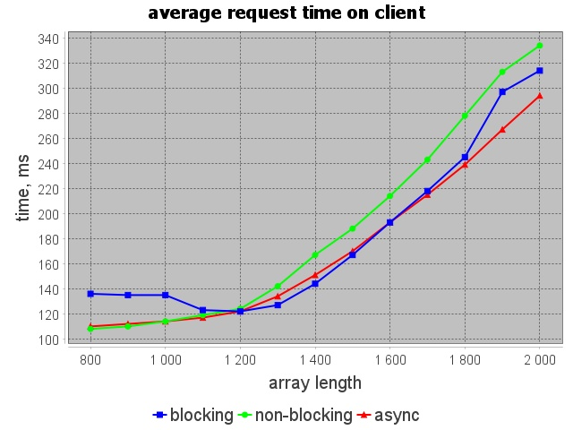
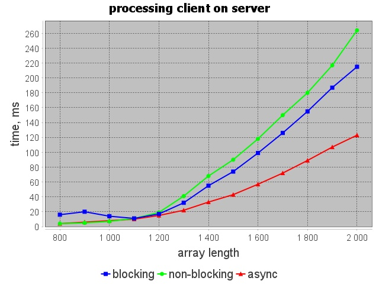
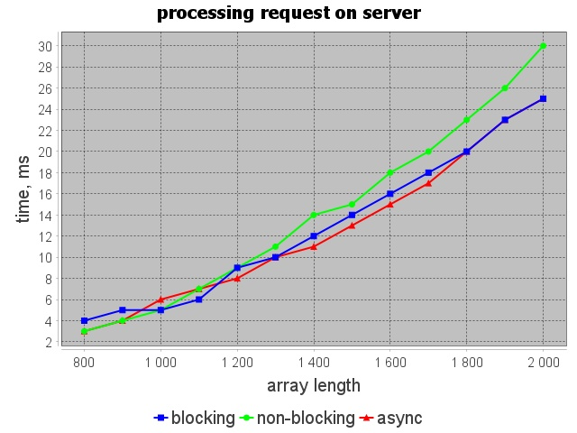
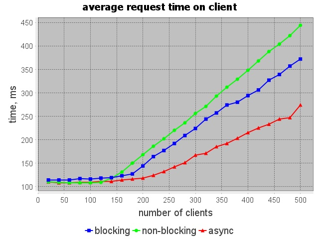
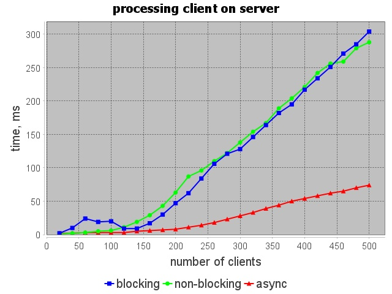
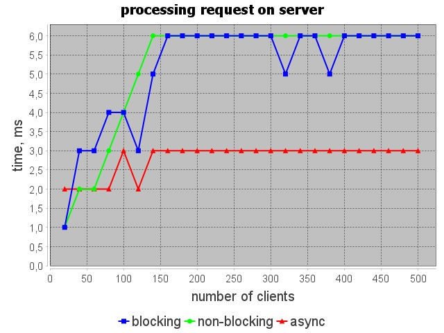
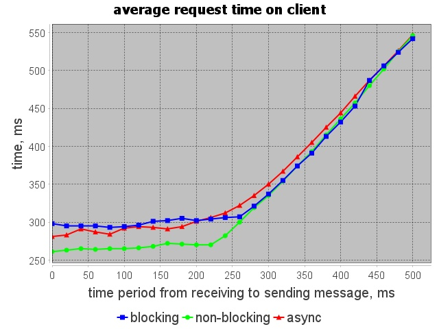
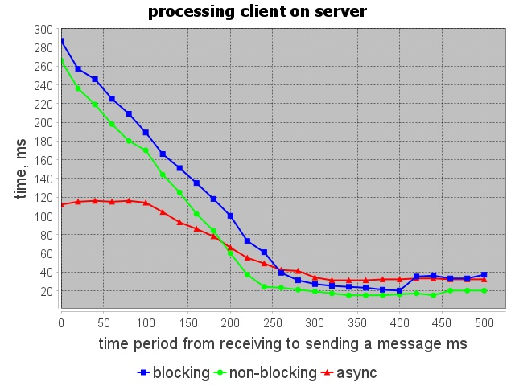
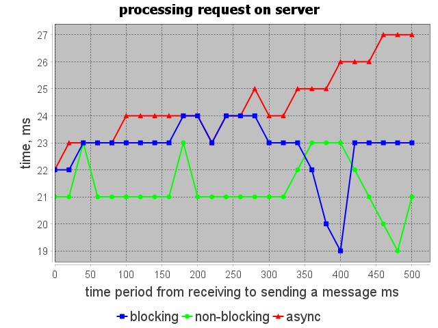

## Описание

В данном репозитории лежит приложение, которое позволяет тестировать производительность той или иной архитектуры сервера.

Артефакты работы приложения можно найти в следующих папках:
- Графики находятся в папке [image](/images)
- Файлы с результатами находятся в папке [results](/results). В данной папке находятся результаты тестирования при изменении того или иного параметра. Каждому опыту соответствуют 4 файла: 3 файла с результатом тестирования и 1 файл (`*_description.txt`) с описанием

## Графики при изменении длины массива

### Среднее время одного запроса на клиенте

Увеличение среднего времени запроса на клиенте вполне обосновано, так как при увеличении длины массива увеличивается время сортировки на сервере, и как следствие увеличивается среднее время запроса на клиенте. Кроме того при увеличении длины массива возрастает объем пересылаемых данных между клиентом и сервером, что также сказывается на среднем времени запроса на клиенте.

### Время обработки клиента на сервере

Увеличение времени обработки клиента на сервере также связано с увеличением длины массива, так как при увеличении длины массива увеличивается время сортировки, и как следствие время обработки клиента.

На данном графике видно, что асинхронная архитектура работает быстрее своих конкурентов, при этом отрыв по времени увеличивается с ростом количества элементов в массиве. 

Также можно заметить, что неблокирующая архитектура до длины массива `1200` обрабатывает клиента быстрее, чем блокирующая. Однако при увеличении длины массива до `2000` неблокирующая архитектура начинает проигрывать блокирующей по времени обработки клиента. Предполагаю, что это связано с тем, что неблокирующая архитектура справляется лучше с маленькими сообщениями, как было объяснено на лекции. Блокирующая же архитектура работает быстрее, когда клиенты отправляют большие сообщения.

### Время обработки запроса на сервере

Эти замеры учитывают лишь время затрачиваемое на обработку запроса. При увеличении длины массива объем запроса увеличивается, и как следствие увеличивается затрачиваемое на сортировку время. Все три архитектуры справляются с этой задачей приблизительно одинаково.

## Графики при изменении количества одновременно работающих клиентов

### Среднее время одного запроса на клиенте

При увеличении количества клиентов увеличивается нагрузка на сервер, все три архитектуры начинают работать хуже, и как следствие увеличивается среднее время работы клиента.

### Время обработки клиента на сервере

В этой ситуации асинхронная архитектура снова показывает лучшие результаты относительно своих конкурентов.

При увеличении количества клиентов отрыв асинхронной архитектуры от своих конкурентов увеличивается.  Предполагаю, что блокирующая архитектура работает медленнее асинхронной из-за того, что создаются очень много потоков, в результате на переключение контекста тратится очень много времени. Неблокирующая же архитектура показывает плохие результаты из-за того, что сообщение достаточно большого размера (`1000` элементов в массиве), клиентов становится достаточно много, и чтение в одном потоке, и запись - в одном потоке не справляются со своими задачами.

При этом неблокирующая работает медленнее блокирующей, предполагаю это связано с тем, что объем сообщений (`1000` элементов в массиве) достаточно большой, чтобы в блокирующей архитектуре читающие/пишущие потоки работали меньше, чем потоки, которые выполняют сортировку.

### Время обработки запроса на сервере

Результаты на трех архитектурах различаются незначительно. При этом из графика можно сделать вывод, что время сортировки не зависит от количества клиентов.

## Графики при изменении временного промежутка от получения сообщения до отправки следующего (D)

### Среднее время одного запроса на клиенте

Из графика видно, что при увеличении `D` среднее время одного запроса на клиенте увеличивается для трех архитектур. При этом можно заметить, что чем больше значение `D`, тем более похожими становятся результаты всех трех архитектур.

### Время обработки клиента на сервере

Из графика видно, что на сервере ситуация противоположная. Чем больше `D`, тем меньше тратится времени на обработку запроса. Предполагаю, что это связано с тем, что при увеличении `D` уменьшается нагрузка на сервер.

### Время обработки запроса на сервере

Из графика можно сделать вывод, что время сортировки почти не зависит от `D`.