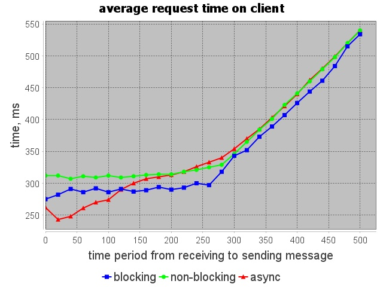
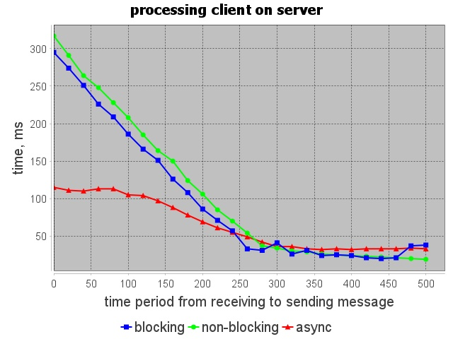
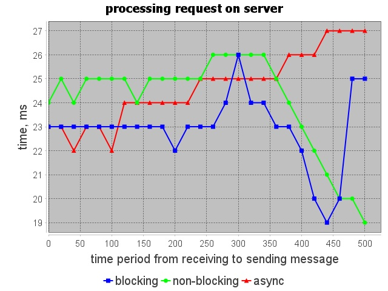

## Графики при изменении длины массива

## Графики при изменении количества одновременно работающих клиентов

## Графики при изменении временного промежутка от получения сообщения до отправки следующего

