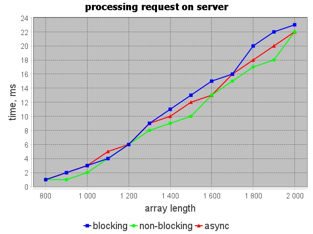

## Описание

В данном репозитории лежит приложение, которое будет позволять тестировать производительность той или иной архитектуры сервера.

Артефакты работы приложения можно найти в следующих папках:
- Графики находятся в папке [image](/images)
- Файлы с результатами находятся в папке [results](/results). В данной папке находятся результаты тестирования при изменении того или иного параметра. Каждому опыту соответствуют 4 файла: 3 файла с результатом тестирования и 1 файл (`*_description.txt`) с описанием

## Графики при изменении длины массива

### Среднее время одного запроса на клиенте

Данные результаты вполне справедливы. Так как при увеличении длины массива возрастает объем пересылаемых данных между клиентом и сервером. Кроме того при увеличении длины массива увеличивается время сортировки, и как следствие увеличивается среднее время запроса.

### Время обработки клиента на сервере

Эти результаты также вполне справедливы, так как при увеличении длины массива увеличивается время сортировки, и как следствие увеличивается время обработки запроса уже на сервере.

### Время обработки запроса на сервере

Эти замеры учитывают лишь время затрачиваемое на обработку запроса. При увеличении длины массива объем запроса увеличивается, и как следствие увеличивается затрачиваемое время. Обе архитектуры справляются с этой задачей приблизительно одинаково.

## Графики при изменении количества одновременно работающих клиентов

### Среднее время одного запроса на клиенте

### Время обработки клиента на сервере

### Время обработки запроса на сервере

## Графики при изменении временного промежутка от получения сообщения до отправки следующего

### Среднее время одного запроса на клиенте

### Время обработки клиента на сервере

### Время обработки запроса на сервере

