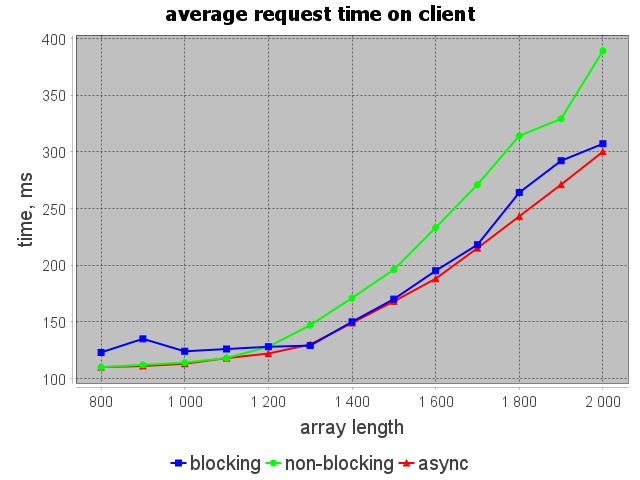
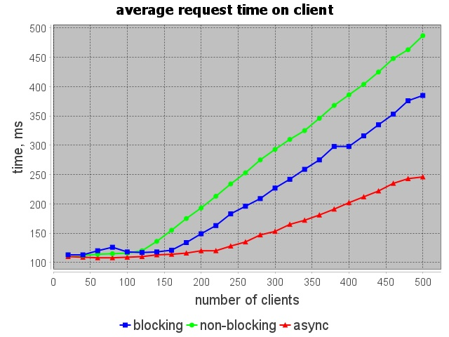
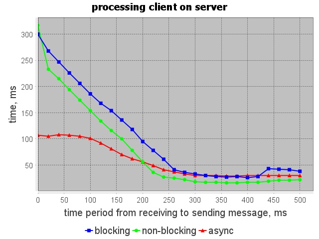
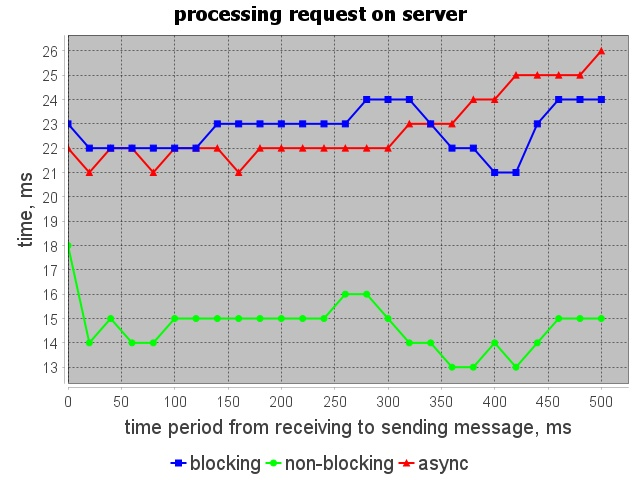

## Описание

В данном репозитории лежит приложение, которое позволяет тестировать производительность той или иной архитектуры сервера.

Артефакты работы приложения можно найти в следующих папках:
- Графики находятся в папке [image](/images)
- Файлы с результатами находятся в папке [results](/results). В данной папке находятся результаты тестирования при изменении того или иного параметра. Каждому опыту соответствуют 4 файла: 3 файла с результатом тестирования и 1 файл (`*_description.txt`) с описанием

## Графики при изменении длины массива

### Среднее время одного запроса на клиенте

Увеличение среднего времени запроса на клиенте вполне обосновано, так как при увеличении длины массива увеличивается время сортировки на сервере, и как следствие увеличивается среднее время запроса на клиенте. Кроме того при увеличении длины массива возрастает объем пересылаемых данных между клиентом и сервером, что также сказывается на среднем времени запроса на клиенте.

### Время обработки клиента на сервере

Увеличение времени обработки клиента на сервере аналогично приведенному выше случаю связано с увеличением длины массива, так как при увеличении длины массива увеличивается время сортировки. Кроме того при увеличении длины массива возрастает объем пересылаемых данных между клиентом и сервером, что также сказывается на среднем времени запроса на клиенте.

На данном графике видно, что асинхронная архитектура показывает самые самые лучшие результаты, предполагаю, что это связано с тем, что в данной реализации отправка данных происходит сразу после сортировки массива. Также можно заметить, что неблокирующая архитектура до длины массива `1100` показывает приблизительно такие же результаты, как и все остальные архитектуры. Однако при увеличении длины массива до `2000` неблокирующая архитектура начинает проигрывать даже блокирующей, предполагаю, что это связано с тем, что в неблокирующей архитектуре только один поток отправляет данные, а при увеличении длины массива объем данных, которые надо отправить в одном запросе становится настолько большим, что единственный поток, который отправляет данные в неблокирующей архитектуре справляется хуже, чем много потоков в блокирующей архитектуре.

### Время обработки запроса на сервере

Эти замеры учитывают лишь время затрачиваемое на обработку запроса. При увеличении длины массива объем запроса увеличивается, и как следствие увеличивается затрачиваемое время. Все три архитектуры справляются с этой задачей приблизительно одинаково.

## Графики при изменении количества одновременно работающих клиентов

### Среднее время одного запроса на клиенте

При увелечении количества клиентов увеличивается нагрузка на сервер, и как следствие все три архитектуры начинают работать хуже.

### Время обработки клиента на сервере

В этой ситуации асинхронная архитектура снова показывает лучшие результаты. Предполагаю, что блокирующая архитектура остает из-за того, что создаются очень много потоков, в результате на смену контекста тратится очень много времени. Неблокирующая же архитектура показывает плохие результаты из-за того, что единственный поток не успевает отправлять ответы клиентам. При этом блокирующая и неблокирюущая архитектура при увеличении количества клиентов идут приблизительно вровень.

### Время обработки запроса на сервере

Результаты на трех архитектурах различаются незначительно. При этом из графика можно сделать вывод, что время сортировки почти не зависит от количества клиентов.

## Графики при изменении временного промежутка от получения сообщения до отправки следующего

### Среднее время одного запроса на клиенте

Из графика видно, что при увеличении временного промежутка среднее время одного запроса на клиенте увеличивается для трех архитектур. При этом можно заметить, что чем больше значение временного промежутка, тем одинаковее становятся результаты всех трех архитектур.

### Время обработки клиента на сервере

Из графика видно, что на сервере ситуация противоположная. Чем больше значение временного промежутка от получения сообщения и отправки следующего, тем меньше тратится времени на обработку запроса. Предполагаю, что это связано с тем, что при увеличении значения временного промежутка уменьшается нагрузка на сервер, и как следствие сервер начинает быстрее обрабатывать запросы.

### Время обработки запроса на сервере

Результаты на трех архитектурах различаются незначительно. При этом из графика можно сделать вывод, что время сортировки почти не зависит от количества клиентов.